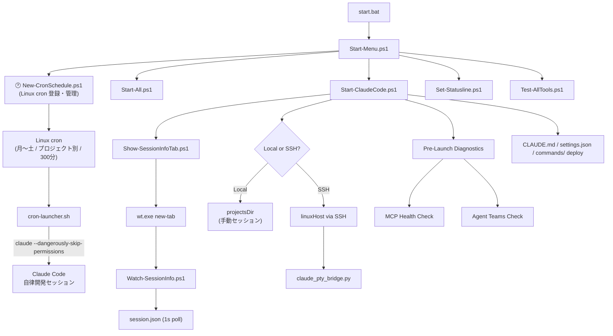
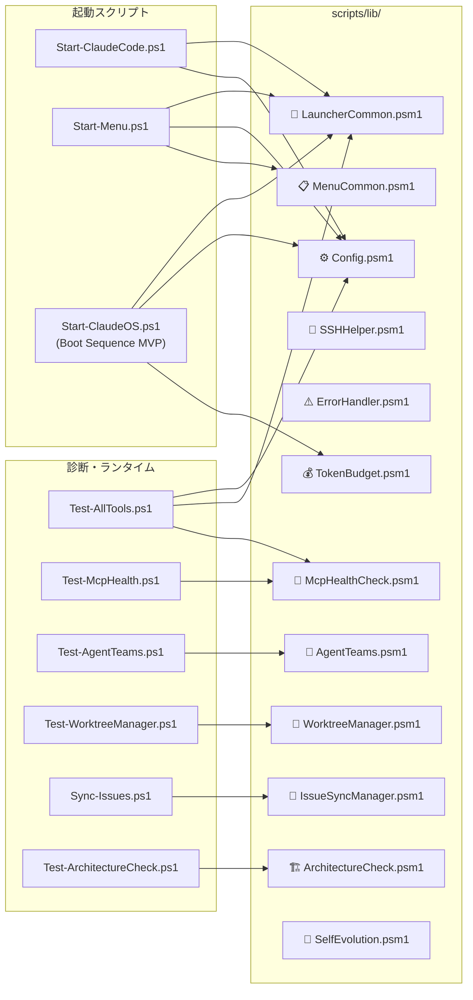
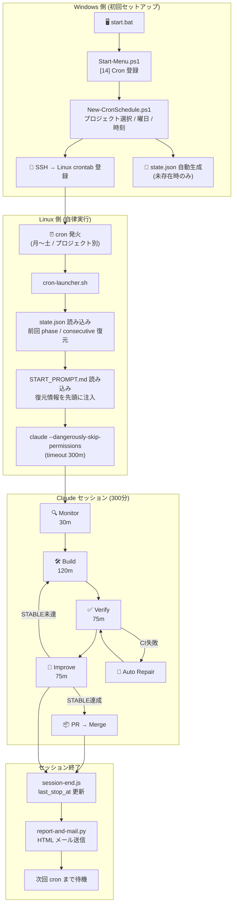
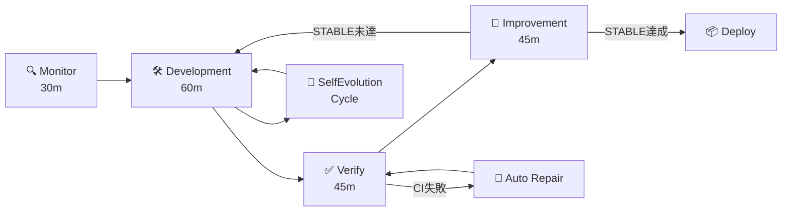
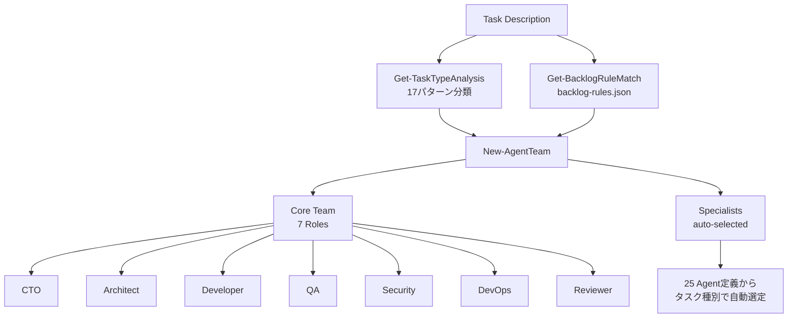
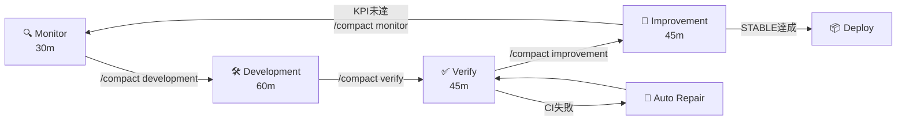

# Claude Code Autonomous Development StartUp Tools

> Windows から **Claude Code** を中心とした自律開発環境を立ち上げるためのスタートアップツールです。

`ClaudeOS v9.0` (/goal 駆動 / Agent Teams / Agent View / Boot Sequence / Self Evolution / Architecture Check / Issue Factory / CodeRabbit Review / Dynamic Orchestration) をカーネルに据え、ローカル起動・SSH リモート起動・診断・Pester テスト・GitHub Issues / Projects / Actions 連携を一括提供します。

> **📌 v3.1.0 で Claude Code 専用ツールに整理**
> v3.1.0 より、Codex CLI / GitHub Copilot CLI の起動メニュー (S2/S3/L2/L3) は削除されました。本ツールは **Claude Code 専用の自律開発ランチャー** として位置づけを明確化し、Linux crontab 連携・セッション情報タブ・Statusline グローバル適用などの新機能に投資が集中しています。

> **🚀 ClaudeOS v9.0 — `/goal` + Agent Teams + Agent View 完全統合**
> Claude Code v2.1.139+ の公式機能を全統合。`/goal` コマンドで達成条件を設定し Haiku が自動判定、Agent Teams で並列協調開発、`claude agents`（Agent View）でセッション監視。固定ループ → 動的判断型へ移行。詳細は [`CLAUDE.md`](./CLAUDE.md) を参照。

> **🎨 v3.3.1 — Mission Control ダッシュボード全面改善 + /goal MVP RC テンプレート刷新**
> Cron管理週間スケジュール全幅レイアウト・正式名称2行表示・Boot Sequenceアクティブセッションパネル・イベントログ日本語化など、Mission Control WebUI のUX/UI を全面強化。`/goal` テンプレートを「MVP Release Candidate 完成版」（完了条件10項・対象外・停止条件明記）に刷新。

> **🔄 v3.3.0 — テスト検証・デバッグ統合指示書 + Mission Control WebUI + START_PROMPT 強化**
> `11-test-debug-integration.md` を新規追加（5カテゴリ：フロントエンド・バックエンド・セキュリティ・インフラ・DB の検証・デバッグ方法論 + Playwright E2E 必須 + Codex/CodeRabbit 統合フロー）。品質ゲート条件: Codex エラー=0 / CodeRabbit Critical/High=0 / テスト成功率100% / STABLE N=3。`_footer.md` に `/goal` 10ループテンプレートを追加。NASA風 Mission Control WebUI を `scripts/dashboards/mission-control.html` に実装（Projects/AgentTeams/CI/Cron/Boot/EventLog 6パネル）。

> **🧪 v3.2.107 — WebUI 全テスト検証 250 項目を全プロジェクト実行の最終プロンプトに追加**
> フロントエンド 110 項目 ＋ バックエンド 140 項目（AI 開発系検証含む）の 250 項目チェックリストを `10-webui-final-verification.md` として追加し、全プロジェクトの START_PROMPT.md 末尾に自動組み込み。詳細は [`CHANGELOG.md`](./CHANGELOG.md) を参照。

> **📨 v3.2.0 — Cron HTML メールレポート (Visual Recap Mail)**
> Cron で起動された ClaudeCode セッションの完了時に、**HTML 形式のレポートメール** を Gmail SMTP 経由で送信。アイコン+色付き表組み+実行サマリ(Monitor/Development/Verify/Improvement の出現回数/エラー検出/STABLE 達成)+次フェーズ提案を含む。送信先は `CLAUDEOS_DEFAULT_TO`(未設定時 `CLAUDEOS_SMTP_USER`)で指定し、SMTP 認証情報は `~/.env-claudeos` の Linux 環境変数で管理(config.json には書かない設計)。詳細は [`docs/common/16_HTMLメールレポート設定.md`](./docs/common/16_HTMLメールレポート設定.md) を参照。

## 対応ツール

| ツール | 提供元 | 位置付け | 主な用途 |
|--------|--------|---------|---------|
| 🌟 **Claude Code** | Anthropic | **唯一の起動対象** — ClaudeOS v9.0 統合 / `/goal` 駆動 / Agent Teams / Agent View / Boot Sequence / 動的自律開発 | 大規模なコード修正、レビュー、自律開発、Issue/PR 自動化、Linux cron による週次自律実行 |

> v3.1.0 以降、Codex CLI / GitHub Copilot CLI の起動メニューは提供しません。`Start-CodexCLI.ps1` / `Start-CopilotCLI.ps1` ファイル自体はリポジトリ内に残していますが、`config.json` の `tools.codex.enabled = false` / `tools.copilot.enabled = false` で無効化されています。

---

## 開発状況

| 項目 | 状態 |
|------|------|
| バージョン | **v3.3.1** (Mission Control ダッシュボード全面改善 + /goal MVP RC テンプレート刷新) — 旧: v3.3.0 |
| テスト | **776件** — Pester (Unit 21 / Integration 11 / Smoke 1) |
| CI | ✅ SUCCESS |
| ClaudeOS (Claude Code 専用) | **v9.0** (`/goal` 駆動 / Agent Teams パターン A/B/C / Agent View / 動的判断 / 週次フェーズ制御 / learning パターン記録 / Stop Conditions 厳格化 / Opus 4.7 最適化 / 1H cache / PreCompact hook) |
| Agents | **28体** の特化サブエージェント (2026Q2 棚卸し後、追加復元済み) |
| Skills | **0個** — Claude Opus 4.6 内包能力で代替可能な汎用スキルを棚卸しで全削除 |
| Hooks | **4個** — agent-risk-check / capture-result / onboarding-refresh / usage-history-recorder |
| Boot Sequence | `Start-ClaudeOS.ps1` (Step 3 Memory/Step 5 Executive Init/Step 6 Management Init/Step 7 Agent Init/Step 8 Loop Engine Start/Step 9 Dashboard 実装完了) ✅ |

### Agent Teams 対応レベル (Claude Code 専用)

> Codex CLI / GitHub Copilot CLI には適用されません。

| 機能 | レベル | 説明 |
|------|--------|------|
| Orchestrator | 3 | 起動フロー中心 |
| Project Switch | 3 | プロジェクト選択・記録・ソート |
| Monitor / Verify Loop | 3 | テスト・CI 統合 |
| Agent Teams 可視化 | 4 | ランタイムエンジン + 能力マトリクス表示 |
| MCP サーバー連携 | 4 | モジュール化・メニュー統合・ランタイムプローブ |
| Pre-Launch Diagnostics | 4 | 起動前 MCP/Agent 自動チェック |
| Worktree Manager | 3 | WorktreeManager.psm1 実装済み |
| Backlog Manager | 3 | IssueSyncManager.psm1 双方向同期 |
| Issue Sync CI/Hooks | 4 | issue-sync.yml 自動同期 + CI 検証 |
| Self Evolution | 3 | SelfEvolution.psm1 セッション学習ループ実装済み |
| Architecture Check | 3 | ArchitectureCheck.psm1 違反自動検出実装済み |

### ClaudeOS エージェント構成 (2026Q2 棚卸し後)

> 2026Q2 棚卸し (PR #122) 後、ドメイン固有知識エージェントを追加復元。現在 **28体**。

| ドメイン | Agent数 | 主なエージェント |
|----------|---------|-----------------|
| Quality | 3 | security-reviewer, e2e-runner, tester |
| Language Reviewer | 7 | typescript, python, go, java, kotlin, rust, cpp reviewer |
| Build Resolver | 7 | build-error-resolver, go/java/kotlin/rust/cpp/pytorch resolver |
| Infrastructure | 1 | database-reviewer |
| Design | 1 | architect |
| Development | 2 | dev-api, dev-ui |
| Operations | 2 | ops, security |
| Orchestration | 1 | orchestrator |
| Testing | 1 | qa |
| 🗄️ CMDB | 1 | cmdb-agent（構成管理・依存関係マップ・変更影響分析） |
| 📋 Audit | 1 | audit-agent（変更証跡・ISO/J-SOX 準拠確認・監査レポート） |

### Hooks 構成 (4個)

> `.claude/settings.json` の `hooks` セクションに登録済み。スクリプト本体は `.claude/claudeos/scripts/hooks/` に配置。

| Hook | 種別 | スクリプト | 機能 |
|------|------|-----------|------|
| `session-start` | SessionStart | `session-start.js` | state.json 読み込み・週次フェーズ自動計算（v9.0）・KPI サマリー表示・blocked_issues 一覧表示・`current_session_start_at` / trigger 書き込み |
| `pre-compact` | PreCompact | `pre-compact.js` | compact 直前に state.json へタイムスタンプを記録 |
| `session-end` | Stop | `session-end.js` | `last_stop_at` 書き込み・learning パターン記録（v9.0: 成功/失敗パターンを `state.learning` へ追記）・STABLE 通知実行 |
| `usage-tracker` | PostToolUse (Agent) | `usage-tracker.js` | Agent ツール呼び出しを検出し `learning.usage_history.agents` へ使用実績を記録 |

### Skills 構成

> 2026Q2 棚卸しにて、Claude Opus 4.6 の内包能力で代替可能な汎用スキル 36個を全削除。
> 高コスト・低価値なスキル定義の維持を排除し、モデル能力に委譲する設計に移行。

---

## 標準コマンド

日常運用で最も使うコマンドを 4 つの動詞に集約しています。前提条件は PowerShell 5.1 以上、標準コマンド実行は PowerShell 7 を推奨します（`pwsh -NoProfile` 推奨）。

| 動詞 | コマンド | 目的 |
|---|---|---|
| **lint** | `Invoke-ScriptAnalyzer -Path . -Recurse -Severity Error` | PSScriptAnalyzer による静的解析（Error 粒度で CI ゲート、Warning は非ブロッキング） |
| **test** | `Invoke-Pester .\tests -CI` | Pester 全テスト（現在 680 件 / Unit + Integration + Smoke）。`-CI` で `testResults.xml` 生成 |
| **build** | `.\scripts\main\Start-ClaudeOS.ps1 -DryRun` | ブートシーケンス検証（Step 1 〜 9 を実行せず設定のみ確認） |
| **security** | `.\scripts\test\Test-McpHealth.ps1` + `gitleaks detect --source .`（CI と同等目的） | MCP サーバーヘルス + secret 漏洩スキャン（CI では [`security-scan.yml`](./.github/workflows/security-scan.yml) が gitleaks 実行） |

> CI 側の同等コマンドは [`.github/workflows/ci.yml`](./.github/workflows/ci.yml) と [`.github/workflows/security-scan.yml`](./.github/workflows/security-scan.yml) を参照。

詳細な診断コマンドは [`診断とテスト`](#診断とテスト) セクションへ。

---

## アーキテクチャ



## モジュール構成



## Linux cron 完全自律実行 — セットアップから自律ループまでのフロー



## 自律開発ループ詳細



## Agent Teams ランタイム



---

## 主な機能

> 凡例: ⭐ = Claude Code 専用 (ClaudeOS v7.4 拡張)、🔧 = 全対応ツール共通

| 機能 | 区分 | 説明 |
|------|------|------|
| 🖥️ 起動メニュー | 🔧 共通 | `start.bat` から対応ツールを対話的に選択 |
| 🔀 ローカル/SSH切替 | 🔧 共通 | Windows ローカルと Linux SSH の両対応 |
| 📄 テンプレート自動配備 | 🔧 共通 | `CLAUDE.md` / `AGENTS.md` / `copilot-instructions.md` を自動配置 |
| 🐍 PTY Bridge | 🔧 共通 | SSH経由の Claude Code 操作を堅牢にサポート |
| ⚙️ 一元設定 | 🔧 共通 | `config/config.json` で対応ツールを一元管理 |
| 🩺 診断ツール | 🔧 共通 | `Test-AllTools.ps1` で環境を一括チェック |
| ⚡ CI/CD | 🔧 共通 | GitHub Actions による自動テスト (Pester 680件 — 29 test files) |
| 🧠 ClaudeOS カーネル | ⭐ Claude 専用 | 28体のエージェント + 4フック + 34コマンド |
| 🔌 MCP ヘルスチェック | ⭐ Claude 専用 | `McpHealthCheck.psm1` で4サーバーの起動・接続・状態診断 |
| 🤖 Agent Teams ランタイム | ⭐ Claude 専用 | `AgentTeams.psm1` でタスク分析→Team自動構成→能力マトリクス→可視化 |
| 🏁 Pre-Launch Diagnostics | ⭐ Claude 専用 | Claude Code 起動前に MCP/Agent 状態を自動チェック |
| 🌿 Worktree Manager | ⭐ Claude 専用 | `WorktreeManager.psm1` でGit Worktreeの作成・切替・削除を自動管理 |
| 🔄 Issue/Backlog 同期 | ⭐ Claude 専用 | `IssueSyncManager.psm1` でGitHub Issues ↔ TASKS.md 双方向同期 |
| 💰 Token Budget Manager | ⭐ Claude 専用 | `TokenBudget.psm1` でフェーズ別トークン使用量の自動制御 |
| 🧠 Self Evolution | ⭐ Claude 専用 | `SelfEvolution.psm1` でセッション学習ループ・改善記録の自動化 🆕 |
| 🏗️ Architecture Check | ⭐ Claude 専用 | `ArchitectureCheck.psm1` でアーキテクチャ違反・禁止パターンの自動検出 🆕 |
| 🚀 ClaudeOS Boot Sequence | ⭐ Claude 専用 | `Start-ClaudeOS.ps1` で `.claude/claudeos/system/boot.md` 仕様の 9 ステップ初期化（Step 1/2/3/4/7/9 完全実装済み・Step 3=Memory MCP/Step 7=Agent Init/Step 9=Dashboard）🆕 |
| 🐰 CodeRabbit Review | ⭐ Claude 専用 | `/coderabbit:review` コマンドで 40+ 解析器による静的解析レビュー（Verify フェーズ補完）🆕 |
| 👥 /team-onboarding | ⭐ Claude 専用 | 新メンバー向けオンボーディングガイドの自動生成・出力コマンド 🆕 |
| 🔎 MCP ランタイムプローブ | ⭐ Claude 専用 | `Invoke-McpRuntimeProbe` で MCP サーバーの起動テストを実行 |

---

## クイックスタート

### 前提条件

**Windows 側:**
- Windows 10/11
- PowerShell 5.1 以上
- Node.js 18 以上
- Git / SSH クライアント

**Linux 側（SSH 起動時）:**
- `claude` / `codex` / `copilot` を実行できる環境
- SSH 鍵認証

### セットアップ

```cmd
git clone <repository-url> D:\ClaudeCode-StartUpTools-New
cd D:\ClaudeCode-StartUpTools-New
copy config\config.json.template config\config.json
```

`config/config.json` を環境に合わせて編集:

```json
{
  "projectsDir": "D:\\",
  "sshProjectsDir": "auto",
  "linuxHost": "your-linux-host",
  "linuxBase": "/home/kensan/Projects",
  "tools": { "defaultTool": "claude" }
}
```

ツールインストール:

```powershell
# 必須 (主軸)
npm install -g @anthropic-ai/claude-code

# 任意 (併設ランチャーを使う場合のみ)
npm install -g @openai/codex
npm install -g @githubnext/github-copilot-cli
```

---

## 使用方法

### 対話メニュー

```cmd
start.bat
```

| メニュー | 説明 |
|----------|------|
| `S1` | Claude Code を SSH 起動 **[Linux cron 自律実行 / 5h セッション]** |
| `L1` | Claude Code をローカル起動 **[手動セッション / スケジューラ不要]** |
| `5` | ツール確認・診断 |
| `6` | ドライブマッピング診断 |
| `7` | Windows Terminal セットアップ |
| `8` | MCP ヘルスチェック |
| `9` | Agent Teams ランタイム |
| `10` | Worktree Manager |
| `11` | Architecture Check |
| `12` | Statusline 設定 (グローバル `~/.claude/settings.json` を Linux に一括適用) |
| `13` | Claude ログ監視タブを開く |
| `14` | 🕐 Cron スケジュール 登録・編集・削除 **[SSH / Linux cron / 5h 強制終了]** |
| `15` | Linux セッション状態監視 **[SSH / リアルタイム cron 実行状況]** |

> **自律実行方式**: Linux cron（月〜土 / プロジェクト別 / 300分）が唯一の起動トリガです。  
> **v3.2.70 変更**: Cloud Schedule / `/loop` / `/schedule` は廃止。`New-CronSchedule.ps1`（メニュー14）で Linux cron を直接管理します。

### PowerShell から直接起動

```powershell
# Claude Code 起動
.\scripts\main\Start-All.ps1
.\scripts\main\Start-ClaudeCode.ps1 -Project "my-project"

# Linux Cron 自律実行管理（SSH専用）
.\scripts\main\New-CronSchedule.ps1         # メニュー 14: Cron スケジュール 登録・編集・削除
.\scripts\main\Set-Statusline.ps1            # メニュー 12: Statusline グローバル適用
.\scripts\main\Show-SessionInfoTab.ps1 -SessionId <sid>  # 情報タブを手動で開く

# ClaudeOS Boot Sequence (MVP)
.\scripts\main\Start-ClaudeOS.ps1                    # 9ステップ初期化
.\scripts\main\Start-ClaudeOS.ps1 -DryRun            # 非破壊プレビュー
.\scripts\main\Start-ClaudeOS.ps1 -NonInteractive    # CI / 自動実行向け
```

### 🕐 Linux Cron 自律実行（v3.2.70 正式運用）

Linux cron（メニュー 14 / `New-CronSchedule.ps1`）でプロジェクトごとの自律開発セッションを管理します。

#### Session Info タブ (Windows Terminal)

S1 / L1 / Cron 起動時に自動で Windows Terminal の新規タブ「Claude Session Info」が開きます。`session.json` を 1 秒間隔で poll し、以下をリアルタイム表示:

- 開始時刻 / 終了予定時刻
- 作業時間（分）と経過時間
- 残り時間（秒単位でカウントダウン）
- セッション status (running / completed / exited / cancelled / failed)

セッション中に `/work-time-set 240` 等で max_duration_minutes を変更すると、タブの残り時間も即追従します。

#### メニュー 13: Statusline グローバル適用

Windows 側 `~/.claude/settings.json` の `statusLine` セクションを Linux 側 `~/.claude/settings.json` へ一括同期します。バックアップを取ってから merge するため安全に巻き戻せます。

#### Slash Commands (ClaudeCode 内)

| Command | 用途 |
|---------|------|
| `/work-time-set <分>` | 現セッションの作業時間を変更 |
| `/work-time-reset` | 作業時間をデフォルト 5h に戻す |
| `/session-info` | 現セッションの session.json 整形表示 |

> **廃止済み**: `/cron-register`・`/cron-cancel`・`/cron-list` は v3.2.70 で廃止。  
> メニュー 14 (`New-CronSchedule.ps1`) から Linux cron を直接管理してください。

---

## ClaudeOS v8 完全無人運用システム (Claude Code 専用)

> **本セクションの全機能は Claude Code 上でのみ動作します。** Codex CLI / GitHub Copilot CLI には適用されません。`Start-ClaudeOS.ps1` および `.claude/claudeos/` 配下のカーネル文書群が前提です。

### v8 新機能

| 機能 | 説明 |
|------|------|
| 🏭 AI Dev Factory | CI/Review/KPI結果から Issue を自動生成し GitHub Projects へ反映 |
| 🧮 Priority Intelligence | `state.json` のウェイトベースで優先順位をスコア計算 |
| 🧭 Auto Loop Intelligence | KPI/CI 状態に基づく動的ループ回数制御 |
| 📊 全プロセス可視化 | Agent Teams ログ・フェーズ遷移・KPI を常時表示 |
| 🔗 GitHub Projects 連携 | Issue 状態と Project ステータスの自動同期 |
| 🐰 CodeRabbit 統合 | 40+ 解析器による静的解析レビュー（Verify フェーズ補完） |
| 👥 /team-onboarding | 新メンバー向けオンボーディングガイド自動生成コマンド |
| ⏱ ループ最適化 | Dev=60m/Verify=45m/Improve=45m (Max 20x 週次制限対策) |

### v8.1 新機能 🆕

| 機能 | 説明 |
|------|------|
| 🗜 Phase Compaction | フェーズ遷移時に `/compact [hint]` を標準化し、Context Rot（文脈劣化）を防止 |
| 🎯 Compaction Hints | Monitor↔Development↔Verify↔Improvement の各遷移に最適なヒント例を CLAUDE.md に明文化 |
| 🚦 適用基準 | 3,000行超出力 / rescue 2回以上 / PR 3件以上 / フェーズ60分超 のいずれかで必須適用 |
| ⚠️ Context Rot 警告サイン | 同一指摘の繰り返し / フェーズ判定ミス / ツール選択精度低下 を検知時に即圧縮 |

> 出典: Anthropic 公式ブログ [Using Claude Code: Session Management and 1M Context](https://claude.com/blog/using-claude-code-session-management-and-1m-context)
> 詳細仕様は [`CLAUDE.md` Section 5](./CLAUDE.md#5-運用ループ) 参照

### 自律ループ構成



> 🆕 **v8.1**: フェーズ遷移時の `/compact [hint]` 標準化により、Context Rot（文脈劣化）を防止しつつ長時間自律ループでも品質を維持します。

| ループ | 時間 | 責務 | 禁止事項 |
|--------|------|------|----------|
| Monitor | 30m | 要件・設計・状態確認、タスク分解 | 実装・修復 |
| Development | 60m | 設計、実装、テスト追加 | main 直接 push |
| Verify | 45m | test/lint/build/CI/CodeRabbit確認、STABLE判定 | 未テスト merge |
| Improvement | 45m | リファクタリング、docs更新 | 破壊的変更 |

### STABLE 判定条件

| 条件 | 必須 |
|------|------|
| install | SUCCESS |
| lint | SUCCESS |
| test | SUCCESS |
| build | SUCCESS |
| CI | SUCCESS |
| Codex Review | OK |
| CodeRabbit | Critical/High = 0 |
| error count | 0 |
| security issue | 0 |

### Agent Teams（12ロール）

| ロール | 責務 |
|--------|------|
| CTO | 最終判断、優先順位、時間制御 |
| ProductManager | Issue 生成、要件整理 |
| Architect | アーキテクチャ設計、責務分離 |
| Developer | 実装、修正、修復 |
| Reviewer | Codex レビュー、差分確認 |
| Debugger | 原因分析、Codex rescue |
| QA | テスト、回帰確認 |
| Security | 脆弱性・権限確認 |
| DevOps | CI/CD・PR・Deploy制御 |
| Analyst | KPI 分析、メトリクス評価 |
| EvolutionManager | 改善提案、自己進化管理 |
| ReleaseManager | リリース管理、マージ判断 |

### CI Manager（自動修復）

- CI失敗は必ず失敗として扱う（成功偽装禁止）
- 修復は最小差分、1修復 = 1仮説
- 最大15回リトライ、同一エラー3回で Blocked

---

## 設定の要点

| キー | 説明 |
|------|------|
| `projectsDir` | ローカル参照用のプロジェクトルート |
| `sshProjectsDir` | SSH 実行時の共有ドライブ (`"auto"` で空きレター自動検出) |
| `linuxHost` | SSH 接続先 |
| `linuxBase` | Linux 側のプロジェクトルート |
| `tools.defaultTool` | `Start-All.ps1` のデフォルトツール |

---

## ディレクトリ構成

```text
config/              設定テンプレートと設定ドキュメント
docs/                利用ガイド（共通/Claude/Codex/Copilot）
scripts/lib/         共通モジュール (17 modules)
  Config.psm1          設定管理
  LauncherCommon.psm1  起動共通処理 (1545行 — 分割対象)
  MenuCommon.psm1      メニュー共通処理
  SSHHelper.psm1       SSH接続ヘルパー
  ErrorHandler.psm1    エラーハンドリング
  McpHealthCheck.psm1  MCPヘルスチェック
  AgentTeams.psm1      Agent Teamsランタイム
  WorktreeManager.psm1 Git Worktree管理
  IssueSyncManager.psm1 Issue/Backlog同期
  TokenBudget.psm1     Token Budget自動制御
  ArchitectureCheck.psm1 アーキテクチャ違反検出
  SelfEvolution.psm1   セッション学習・自己進化
  CronManager.psm1     Cronスケジュール管理
  LogManager.psm1      ログ管理
  MessageBus.psm1      メッセージバス
  SessionTabManager.psm1 セッションタブ管理
  StatuslineManager.psm1 ステータスライン管理
scripts/main/        起動スクリプト
scripts/helpers/     PTY bridge 等のヘルパー
scripts/templates/   各ツール向けテンプレート
scripts/test/        診断スクリプト
scripts/tools/       TASKS同期・バックログ管理
tests/               Pester テスト (33 files / 731件 — Unit 21 / Integration 11 / Smoke 1)
Claude/              ClaudeOS 互換ポリシー群
Codex/               Codex AGENTS.md
.claude/claudeos/    ClaudeOS カーネル（198ファイル、配備先 — 編集元は Claude/templates/claudeos/）
.codex/              Codex 設定
.github/             Copilot 設定 / CI ワークフロー
```

---

## 診断とテスト

```powershell
# 全ツール診断
.\scripts\test\Test-AllTools.ps1

# MCP ヘルスチェック
.\scripts\test\Test-McpHealth.ps1

# Agent Teams ランタイム診断
.\scripts\test\Test-AgentTeams.ps1

# Architecture Check (Phase 3) 🆕
.\scripts\test\Test-ArchitectureCheck.ps1

# JSON 出力
.\scripts\test\Test-AllTools.ps1 -OutputFormat Json
.\scripts\test\Test-McpHealth.ps1 -OutputFormat Json
.\scripts\test\Test-AgentTeams.ps1 -OutputFormat Json -Task "Fix CI build"
.\scripts\test\Test-ArchitectureCheck.ps1 -OutputFormat Json

# Pester テスト (433件 — Unit:311 / E2E:122)
Invoke-Pester .\tests\
```

---

## ドキュメント

| カテゴリ | ファイル |
|----------|----------|
| 共通 | `docs/common/01_はじめに.md` 〜 `13_グローバル設定適用設計.md` |
| Claude | `docs/claude/01_概要.md` 〜 `05_ベストプラクティス.md` |
| Codex | `docs/codex/01_概要.md` 〜 `04_ベストプラクティス.md` |
| Copilot | `docs/copilot/01_概要.md` 〜 `04_ベストプラクティス.md` |

---

## 開発ロードマップ (v3.0.0) — Claude Code 専用

> Phase 2 以降のすべてのロードマップ項目は Claude Code / ClaudeOS スタック向けです。Codex CLI / GitHub Copilot CLI の機能拡張は本ロードマップに含まれません。

| フェーズ | 状態 | 主な目標 |
|----------|------|----------|
| Phase 1 ✅ | 完了 (v2.7.0) | P1完了、モジュール基盤確立 |
| Phase 2 ✅ | 完了 (v2.8.0) | Worktree並列開発、Issue自動生成、CI強化 |
| Phase 3 ✅ | 完了 (v2.9.0) | Self Evolution / Architecture Check / Boot Sequence 完全実装 / Dashboard UI / Memory MCP 統合 / CodeRabbit 統合 |
| Phase 4 🚧 | 着手中 (v3.0.0 準備) | リリースノート作成、E2E テスト整備、GitHub Release タグ作成、Issue Sync 修正 |

### Phase 3 進捗 (v2.9.0) — 完了

| タスク | 担当 | 状態 | PR |
|--------|------|------|-----|
| 🧠 Self Evolution システム | Architect | ✅ 完了 | #51 |
| 🏗️ Architecture Check Loop | Architect | ✅ 完了 | #49 |
| 📊 開発ダッシュボード UI (state.json KPI統合) | Developer | ✅ 完了 | #82 |
| 💾 Memory MCP 永続化統合 (Boot Step 3) | Ops | ✅ 完了 | #81 |
| 🔧 Boot Sequence 完全自動化 (Step 7 Agent Init) | Ops | ✅ 完了 | #80 |

**Phase 3 完了率: 5/5 (100%) 🏆 COMPLETE**

### Phase 4 計画 (v3.0.0 GA リリース準備)

| タスク | 優先度 | 状態 |
|--------|--------|------|
| 📋 Issue Sync ワークフロー修正 | P3 | 🚧 Issue #85 追跡中 |
| 📝 v3.0.0 リリースノート作成 | P2 | ⏸ 計画中 |
| 🧪 E2E テスト整備 | P2 | ⏸ 計画中 |
| 🏷 GitHub Release タグ作成 `v3.0.0` | P2 | ⏸ 計画中 |

### 最近のマージ履歴

| PR | 内容 | 日付 |
|----|------|------|
| #88 | feat(templates): ClaudeOS v7.5 テンプレート更新・ループ短縮・CodeRabbit 統合・/team-onboarding 実装 | 2026-04-14 |
| #84 | chore: .gitignore に claude-mem 自動生成 CLAUDE.md を追加 | 2026-04-14 |
| #83 | chore(claudeos): v7.5 — CodeRabbit 統合ポリシー + README Phase 3 完了反映 | 2026-04-14 |
| #82 | feat(dashboard): Issue #71 — Step 9 Dashboard に state.json KPI/フェーズ統合 | 2026-04-14 |
| #81 | feat(boot): Issue #70 — Step 3 Memory Restore を McpHealthCheck.psm1 でワイヤリング | 2026-04-14 |
| #80 | feat(boot): Issue #68 PR-B — Step 7 Agent Init を AgentTeams.psm1 でワイヤリング | 2026-04-14 |
| #79 | chore: フェーズ別モデル制御設定を追加 | 2026-04-14 |
| #77 | chore: gitleaks workflow + Agent Teams Light mode | 2026-04-14 |
| #69 | feat(boot): ClaudeOS Boot Sequence scaffold (MVP / PR-A) | 2026-04-10 |
| #67 | fix: markdownlint MD024 を file-scoped inline disable 化 | 2026-04-10 |
| #66 | fix: START_PROMPT テンプレを最大10回ループ + CTO全権委任に明確化 | 2026-04-10 |
| #51 | Phase 3 — Self Evolution + Architecture Check Loop | 2026-04-08 |

---

## 注意事項

- `Claude Code` は設定上 `--dangerously-skip-permissions` を利用できます。開発環境専用です。
- API キーをソースに保存しないでください。
- SSH 実行では Linux 側の `linuxBase` と Windows 側の共有パスが同じプロジェクト群を指す前提です。

## ライセンス

MIT License
